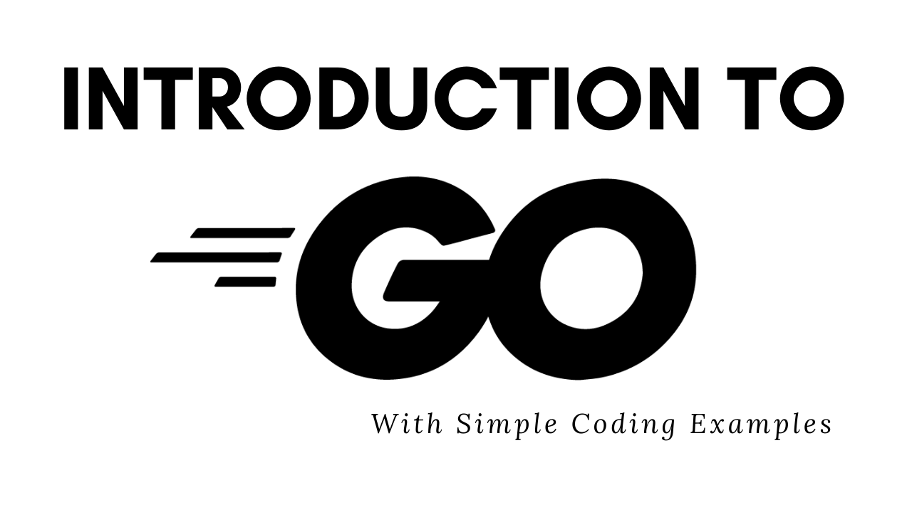

# Golang Introduction

Welcome to `golang-intro`! This repository is dedicated to those beginning their journey in learning the Go programming language. Here, you'll find practical examples and explanations covering various aspects of Go.

## Structure

The content is divided into two main sections for now:

### 1. Introduction
- **Basics:**
    - Variables, constants, operators, etc.
- **Core Concepts:**
    - Functions, control flow, arrays, slices, maps, pointers, etc.
- **Advanced Topics:**
    - Structs, methods, interfaces, goroutines, etc.

### 2. Development
- **API Development:**
    - Creating RESTful APIs, handling authentication, etc.
- **Concurrency:**
    - Understanding and implementing concurrency in Go.
- **Error Handling and Testing:**
    - Writing robust code with proper error handling and tests.
- **Network Programming:**
    - Insights into network and IO programming in Go.

## How to Use This Repository

- Clone the repository and explore the examples.
- Follow the comments in the code for guidance and explanations.
- Refer to the README in sections for additional context and resources.

## Contributing

Feel free to contribute to this repository by:
- Suggesting `new topics or improvements`.
- Adding `more examples or enhancing existing ones`.
- Reporting `issues or bugs`.

## License

This project is licensed under the MIT License - see the [LICENSE.md](LICENSE.md) file for details.